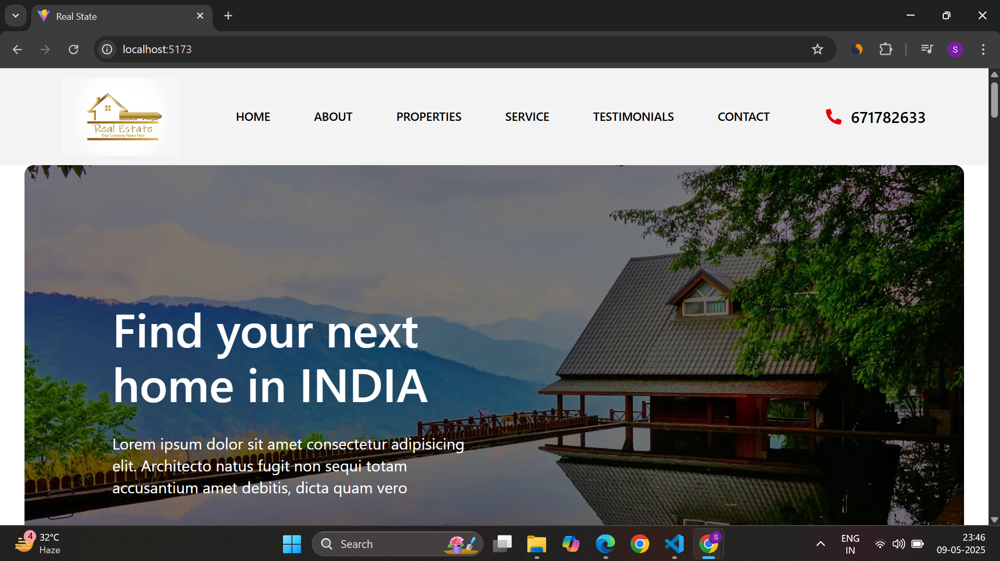
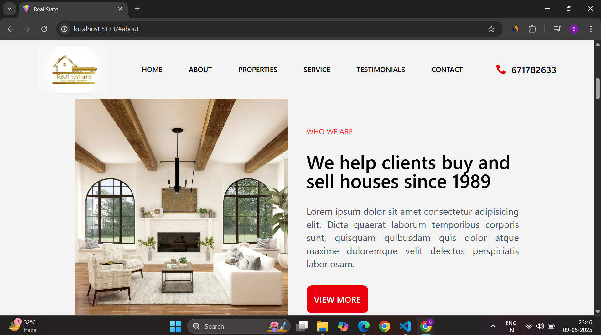
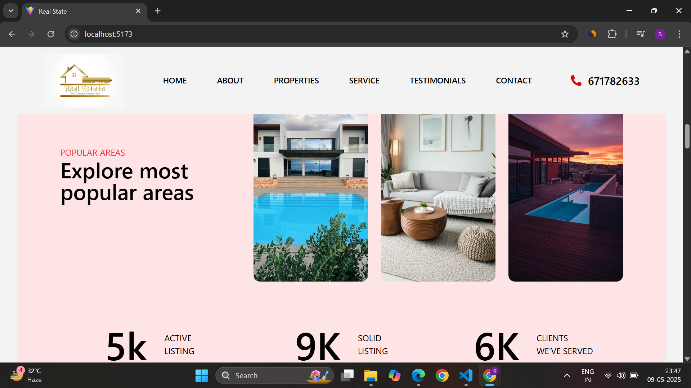
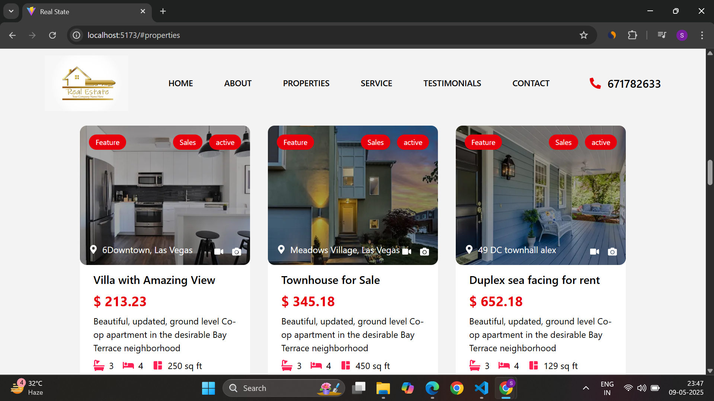
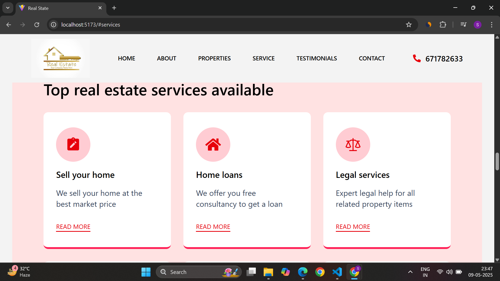
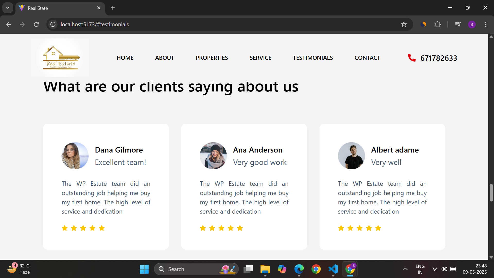
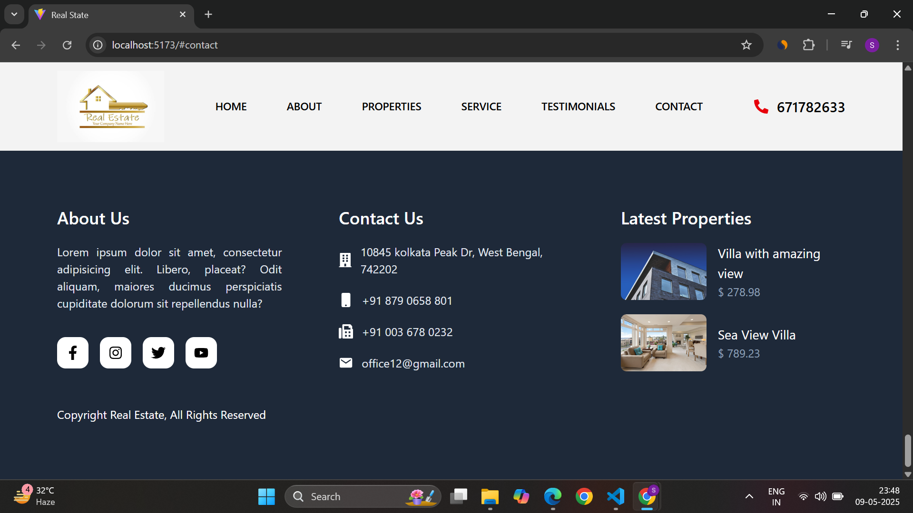

# 🏡 Real Estate Portfolio


> A modern, responsive real estate portfolio single-page website built with **React**, **Tailwind CSS**, and **Vite**. This website features key sections including **About**, **Achievements**, **Property Listings**, **Services**, **Client Testimonials**, and **Contact**, all optimized for both desktop and mobile devices.

---

## ✨ Features

- 🌐 **Fully Responsive** design optimized for all screen sizes.
- 🏡 **Property Listings** showcasing properties with images and descriptions.
- 📑 **Client Testimonials** to build trust with potential clients.
- 💼 **Services Section** to display real estate services offered.
- 🏆 **Achievements** section to highlight successes and milestones.
- 📞 **Contact Form** for inquiries and client interactions.
- ⚡ Fast and optimized with **Vite** for blazing fast loading times.
- 🎨 Designed using **Tailwind CSS** for a beautiful and clean UI.

---

## 🧱 Tech Stack

| Category       | Tech            |
|----------------|-----------------|
| Framework      | [React](https://reactjs.org) |
| Language       | [TypeScript](https://www.typescriptlang.org) |
| Styling        | [Tailwind CSS](https://tailwindcss.com) |
| Routing        | [React Router](https://reactrouter.com) |
| Animation      | [AOS (Animate On Scroll)](https://michalsnik.github.io/aos/) |
| Build Tool     | [Vite](https://vitejs.dev) |

---

## 🚀 Getting Started

### 1. Clone the Repository

```bash
https://github.com/CODESUJON/Realestate-Portfolio-React
cd realstate-portfolio

```bash
npm run dev
```
## 🖼️ Preview

### 🌓 Home 



---

### 🧾 Sections

#### ℹ️ About


#### 🎯 Achievements


#### 💰 Properties


#### 🛠️ Services


#### 🛠️ Testimonials


#### 💰 Contact


#### 🔚 Footer



